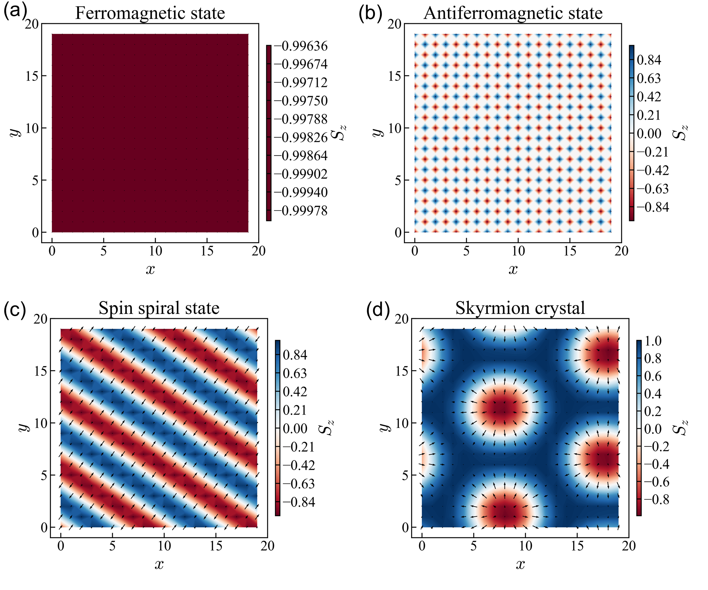

# Magnetic Textures via Monte Carlo Simulation

Classical spin simulations on a 2D square lattice using the extended Heisenberg Hamiltonian, reproducing four canonical magnetic ground states: ferromagnetic, antiferromagnetic, spin spiral, and skyrmion crystal phases.

This repository is part of my ongoing effort to develop computational skills in classical spin models.

---

## The Model

The total energy of the system is:

$$E = -J \sum_{\langle i,j \rangle} \mathbf{S}_i \cdot \mathbf{S}_j - \sum_{\langle i,j \rangle} \mathbf{D}_{ij} \cdot (\mathbf{S}_i \times \mathbf{S}_j) - \sum_i \mathbf{H} \cdot \mathbf{S}_i - A \sum_i (S_{i,z})^2 $$

Each $`\mathbf{S}_i`$ is a classical unit vector on a 2D square lattice. The four terms are:

| Term | Symbol | Role |
|------|--------|------|
| Heisenberg exchange | $`J`$ | Ferromagnetic ($`J > 0`$) or antiferromagnetic ($`J < 0`$) alignment of neighbors |
| Dzyaloshinskii–Moriya interaction | $`\mathbf{D}_{ij}`$ | Antisymmetric exchange; drives spin canting, spirals, and skyrmions |
| Easy-axis anisotropy | $`A`$ | Energetic preference for spins along $`\hat{z}`$ |
| Zeeman coupling | $`\mathbf{H}`$ | External magnetic field; selects and stabilizes topological phases |

Color maps show the out-of-plane component $`S_z`$; quiver arrows show the in-plane ($`S_x`$, $`S_y`$) texture where relevant.

---

## Parameters

A weak easy-axis anisotropy $`A_z = 0.01`$ is applied in all runs.

| Phase | $`J`$ | $`D`$ | $`H_z`$ |
|-------|-------|-------|---------|
| Ferromagnetic (FM) | +1 | — | — |
| Antiferromagnetic (AFM) | −1 | — | — |
| Spin Spiral (SS) | +1 | 1.5 | — |
| Skyrmion Crystal (SKX) | +1 | 0.7 | 0.2 |

---

## Results

*20×20 square lattice. Color: $`S_z`$ component. Arrows: in-plane ($`S_x`$, $`S_y`$) components.*

**Ferromagnetic state (a):** With $`J > 0`$ and no competing interactions, all spins align uniformly along $`-\hat{z}`$. The $`S_z`$ map is featureless ($`S_z \approx -1`$ everywhere), confirming a fully polarized ferromagnetic ground state.

**Antiferromagnetic state (b):** Negative exchange ($`J < 0`$) favors antiparallel nearest neighbors, producing the Néel checkerboard — alternating $`S_z = +1`$ and $`S_z = -1`$ sites. The pattern is sharp and defect-free, consistent with a well-converged ground state on a bipartite lattice.

**Spin spiral state (c):** A large DMI ($`D = 1.5 > J`$) overcomes the ferromagnetic exchange, forcing spins to rotate continuously in space. 

**Skyrmion crystal (d):** At moderate DMI ($`D = 0.7`$) with an applied out-of-plane field ($`H_z = 0.2`$), the competition between exchange, DMI, and Zeeman energy stabilizes a periodic lattice of magnetic skyrmions. Each skyrmion is a topologically non-trivial spin whirl — $`S_z \approx +1`$ at the core, winding continuously to $`S_z \approx -1`$ in the surrounding ferromagnetic background. The applied field is essential: without it, the spiral phase persists and no skyrmion lattice forms.

The progression FM → AFM → SS → SKX illustrates how systematically tuning $`J`$, $`D`$, and $`\mathbf{H}`$ drives the system through distinct topological and magnetic phases — directly relevant to the physics of chiral magnets and spintronic materials.

---

## References

**Heisenberg exchange model:**
- W. Heisenberg, "Zur Theorie des Ferromagnetismus," *Zeitschrift für Physik* **49**, 619–636 (1928).

**Dzyaloshinskii–Moriya interaction:**
- I. Dzyaloshinsky, "A thermodynamic theory of 'weak' ferromagnetism of antiferromagnetics," *Journal of Physics and Chemistry of Solids* **4**, 241–255 (1958).
- T. Moriya, "Anisotropic superexchange interaction and weak ferromagnetism," *Physical Review* **120**, 91–98 (1960).

**Skyrmion lattice — experimental discovery:**
- S. Mühlbauer, B. Binz, F. Jonietz, C. Pfleiderer, A. Rosch, A. Neubauer, R. Georgii, P. Böni, "Skyrmion lattice in a chiral magnet," *Science* **323**, 915–919 (2009).

**Skyrmion physics — review:**
- N. Nagaosa and Y. Tokura, "Topological properties and dynamics of magnetic skyrmions," *Nature Nanotechnology* **8**, 899–911 (2013).

**Monte Carlo methods for spin systems:**
- D. P. Landau and K. Binder, *A Guide to Monte Carlo Simulations in Statistical Physics*, 4th ed., Cambridge University Press (2014).

**Spin spiral and DMI-driven textures:**
- A. Bogdanov and D. Yablonskii, "Thermodynamically stable 'vortices' in magnetically ordered crystals," *Soviet Physics JETP* **68**, 101–103 (1989).
